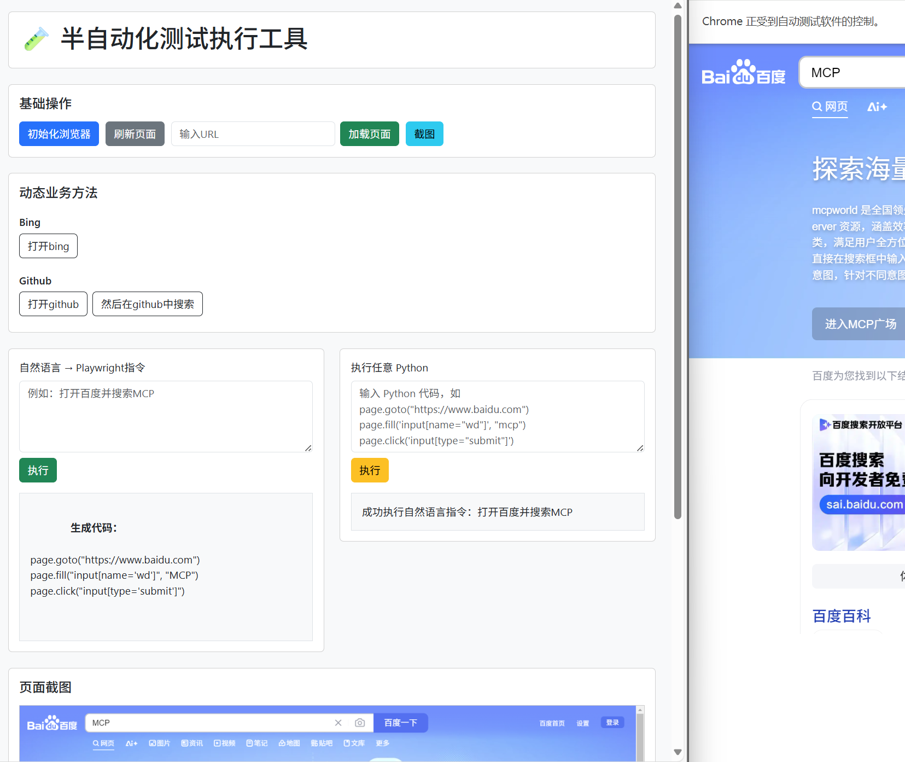

# 半自动化测试执行工具

一个基于 Flask + Playwright 的 Web 自动化测试平台，支持通过页面按钮调用封装好的业务函数、执行 Python 脚本、实时浏览器交互控制，并内置自然语言转 Python 自动化脚本的 AI 功能。专为个人工作流优化设计，可将重复性网页操作转化为：

- 🔄 **一键式自动化流程**：将日常操作（如数据抓取、表单填写等）封装为可复用方法
- 🧩 **模块化功能组合**：通过自由组合注册方法构建复杂工作流
- 🤖 **智能脚本生成**：用自然语言描述即可自动生成可执行的Playwright代码，只支持简单的步骤
- 🕹️ **实时交互控制**：在自动化执行过程中随时介入调整
---

## 🚀 功能特性

- ✅ 启动 / 重启 持久化浏览器，保留登录状态等信息
- ✅ 动态调用注册的自动化方法（通过按钮点击触发）
- ✅ 直接输入并执行 Python 脚本
- ✅ 支持自动截图并展示
- ✅ 异常信息在页面中展示，调试更方便
- ✅ 支持自然语言转 Playwright 脚本（集成大模型，如 DeepSeek）
- ❌ 不支持断言，只为代替重复劳动

---

## 📦 安装依赖

项目使用 Python 3.12+

```bash
pip install -r requirements.txt
playwright install
```

## ▶️ 启动项目

```bash
python app.py
``` 

运行后访问：http://localhost:5000




## 🧪 使用说明
##### 基本控制区
* 初始化浏览器：启动并持久化一个 Chromium 浏览器实例
* 刷新页面：刷新当前页面
* 输入 URL 并加载：跳转浏览器到指定页面


##### 业务方法
你可以在 funcs/ 目录中定义模块，每个模块的类方法通过 @register_method 装饰器注册，将自动生成按钮。
```bash
@register_method("打开百度", category="导航")
def open_baidu(self):
    self.page.goto("https://www.baidu.com")
```

##### 代码执行区
输入任意 Python 脚本代码，方便支持更多场景
```
page.goto("https://www.baidu.com")
```

##### 自然语言 → 脚本
输入类似“打开百度，搜索 Playwright”，后端会通过 AI 转换成 Playwright 脚本并执行。

## 📂 项目结构
```bash
├── ai_executor/
│ └── deepseek_handler.py # AI 脚本处理模块
├── common/ # 公共组件
│ ├── logger.py # 日志记录
│ └── read_data.py # 数据读取
├── log/ # 日志目录
├── playwright_controller/ # 核心控制模块
│ ├── a_methods/ # 方法模块
│ │ └── func1_module.py # 示例模块
│ ├── b_methods/ # 方法模块
│ │ └── func2_module.py # 示例模块
│ │──base_module.py # 常用方法封装
│ │──controller.py # 浏览器控制器
│ │──methods_loader.py # 方法加载器
│ └──methods_registry.py # 方法注册器
├── templates/ # 前端模板
├── userdata/ # 浏览器持久化数据
├── .gitignore
├── app.py # 主入口
├── config.yaml # 配置文件
├── favicon.ico # 网站图标
├── README.md # 项目说明
└── requirements.txt # 依赖列表
```

## 📌 注意事项
* 浏览器关闭后需点击“初始化浏览器”重新激活
* Playwright 的 Sync API 不能在异步事件循环中使用，需确保在主线程运行
* 用户数据目录 userdata/ 会保留登录状态等信息，长时间运行后可能会占用较多磁盘空间

